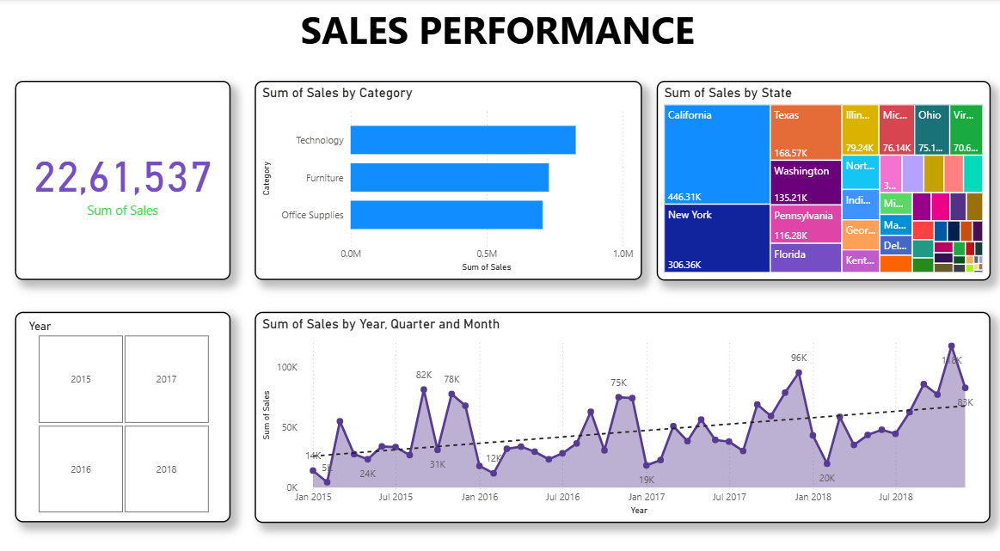
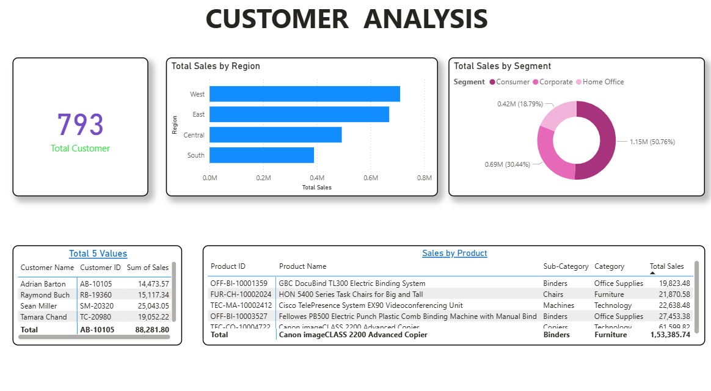
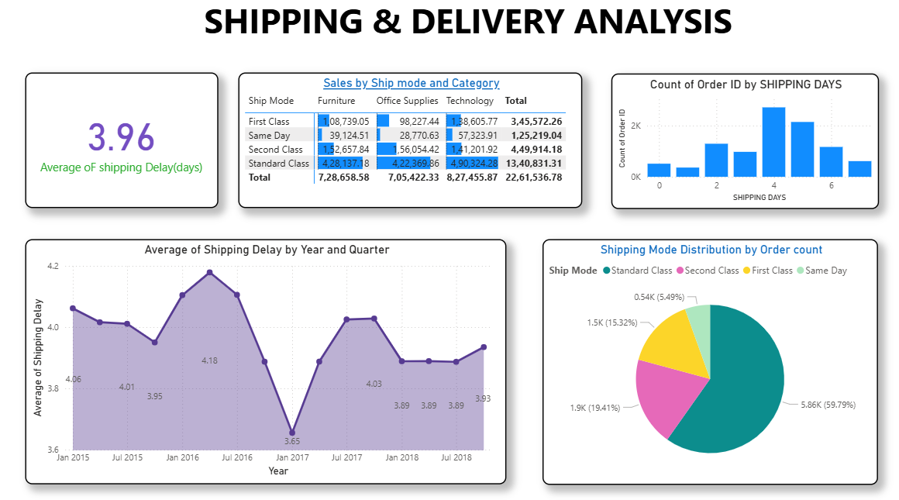
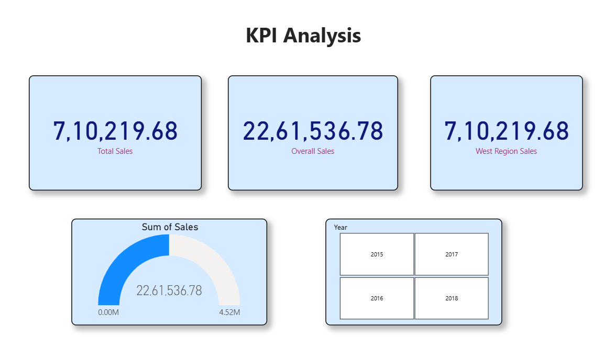

# 📊 Sales Performance Dashboard using Power BI

## 📌 Project Overview

This project presents an interactive **Sales Performance Dashboard** developed using **Microsoft Power BI**. The dashboard helps analyze retail sales data and provides business insights through dynamic visualizations and Key Performance Indicators (KPIs).

The project demonstrates skills in data analysis, dashboard development, DAX measures, and data visualization.

---

🎯 Objectives

- Analyze overall sales performance.
- Track customer and regional sales trends.
- Monitor shipping and delivery metrics.
- Provide interactive business insights through dashboards.


## 📂 Dataset

**Dataset:** Retail Sales Dataset

The dataset contains information related to:

- Order ID
- Order Date
- Customer Details
- Product Information
- Category and Sub-Category
- Region and State
- Sales
- Shipping Mode
- Shipping Days


## 📊 Dashboard Pages

### 1. KPI Analysis
- Total Sales
- Regional Sales
- Sales Gauge
- Year Filter (Slicer)

### 2. Sales Performance
- Sales by Category
- Sales by State
- Sales Trend Analysis
- Year-wise Sales

### 3. Customer Analysis
- Customer Segmentation
- Regional Sales Distribution
- Top Customers
- Product-wise Sales

### 4. Shipping & Delivery Analysis
- Average Shipping Delay
- Shipping Mode Distribution
- Orders by Shipping Days
- Shipping Category Analysis


## 🛠️ Technologies Used

- Microsoft Power BI
- DAX (Data Analysis Expressions)
- Microsoft Excel
- Data Cleaning
- Data Visualization
- Pivot Tables


## 📈 Key Features

- Interactive Dashboard
- KPI Cards
- Slicers
- Treemap Visualizations
- Line Charts
- Bar Charts
- Pie Charts
- Gauge Charts
- Dynamic Filtering


## 📁 Repository Structure

```
Sales_Performance_Dashboard.pbix
Retail_Sales_Dataset.xlsx
Sales_Performance.png
Customer_Analysis.png
Shipping_Delivery.png
KPI_Analysis.png
README.md
```


## 🚀 How to Use

1. Download the `.pbix` file.
2. Open it using Microsoft Power BI Desktop.
3. Load the dataset if required.
4. Explore the interactive dashboards and visualizations.


## 📷 Dashboard Preview

### Sales Performance


### Customer Analysis


### Shipping & Delivery Analysis


### KPI Analysis


---

## 👩‍💻 Author

**Bhavya Sri Kusam**

B.Tech - Computer Science & Engineering (AI & ML)

GitHub: https://github.com/BhavyaKusam6605

LinkedIn: https://www.linkedin.com/in/kusam-bhavya-sri

---

## ⭐ Project Highlights

- Built an interactive Power BI dashboard.
- Performed sales and customer data analysis.
- Used DAX measures for KPI calculations.
- Created business-oriented visualizations.
- Developed a multi-page dashboard for decision-making support.
